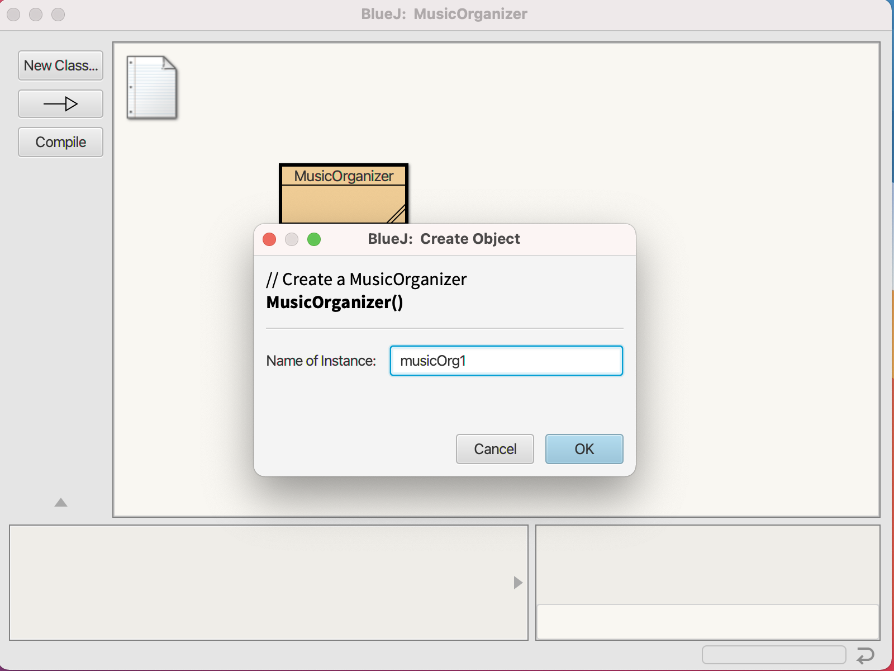
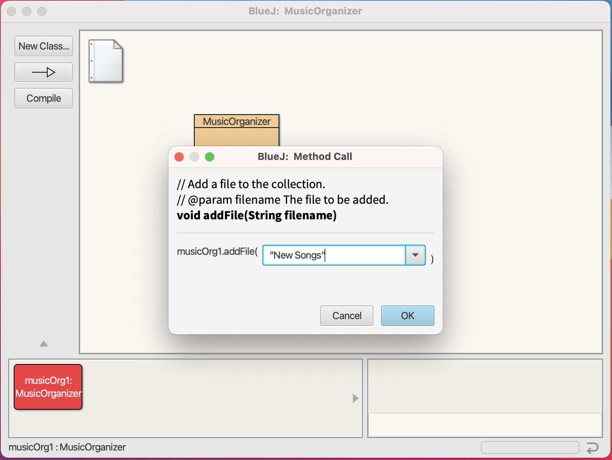
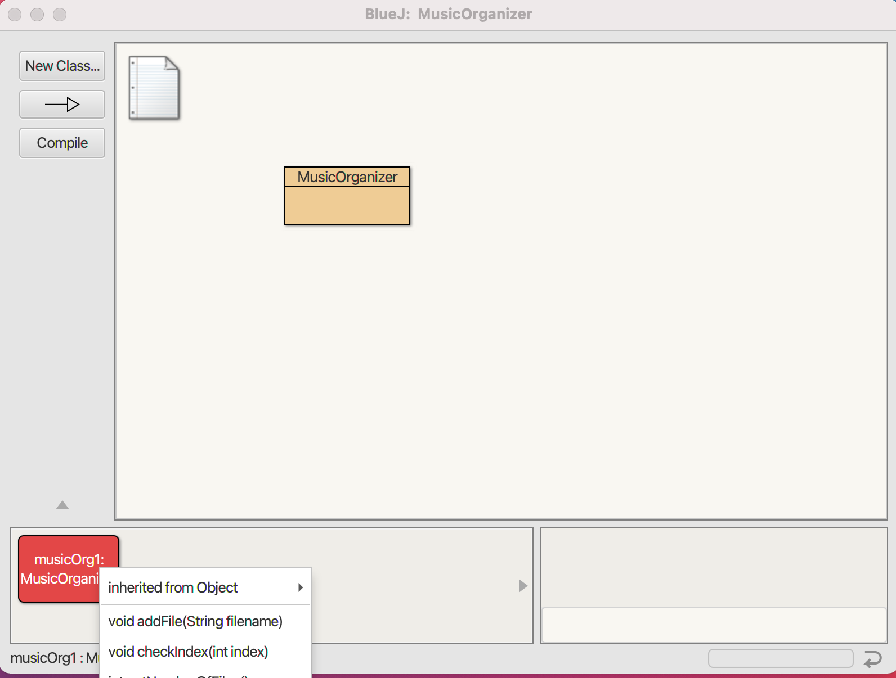
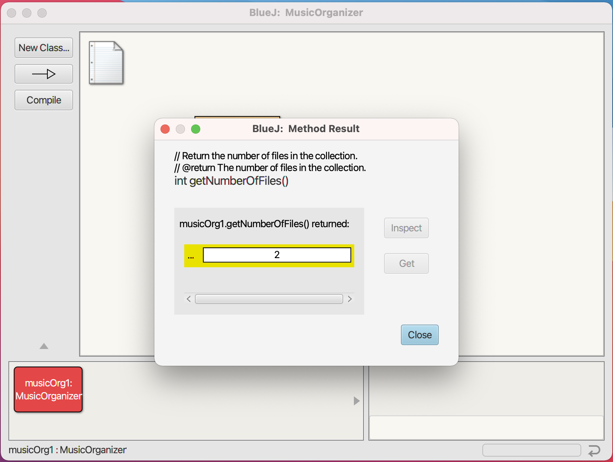
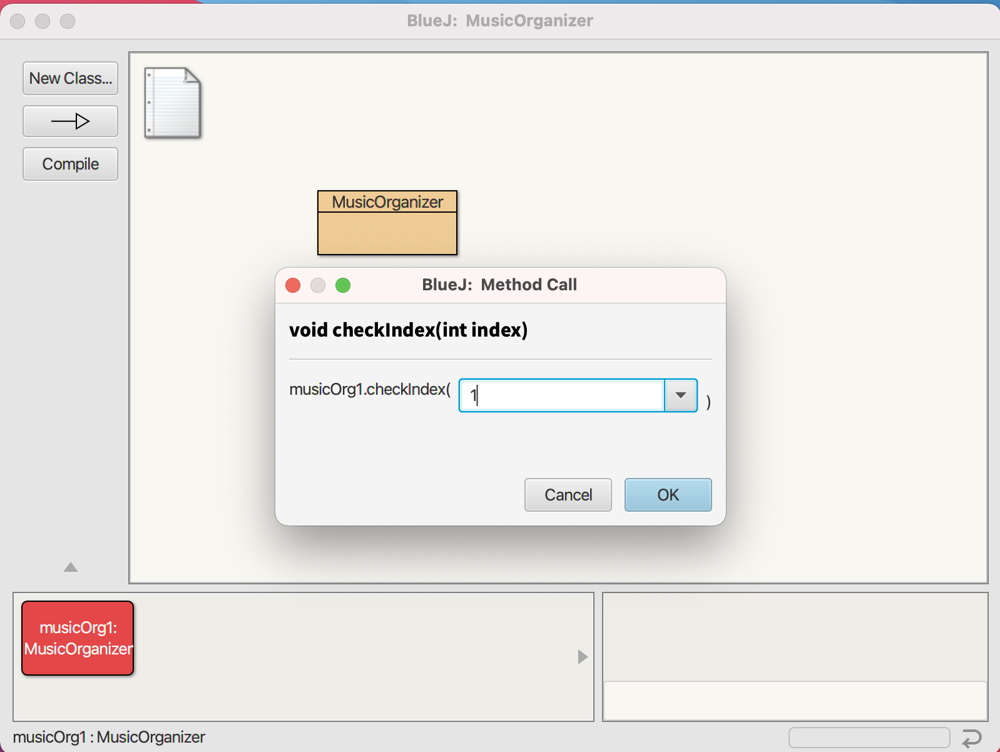
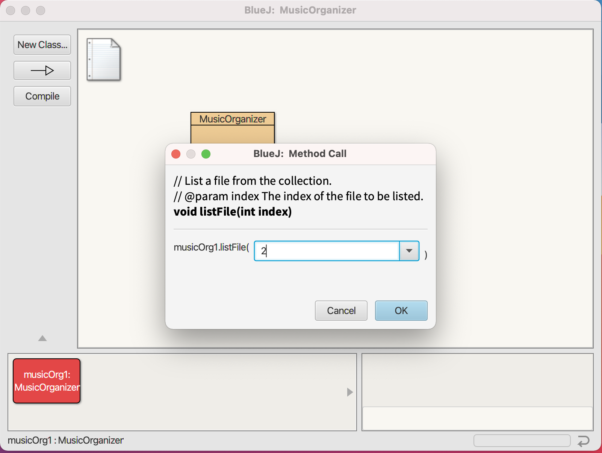
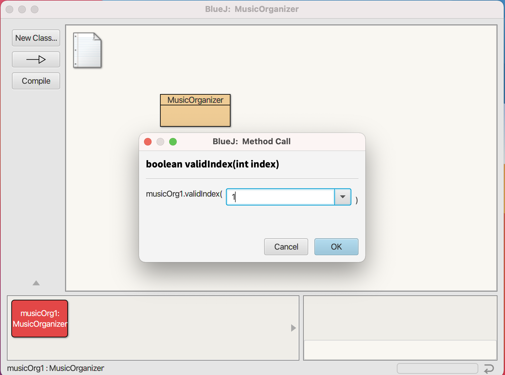
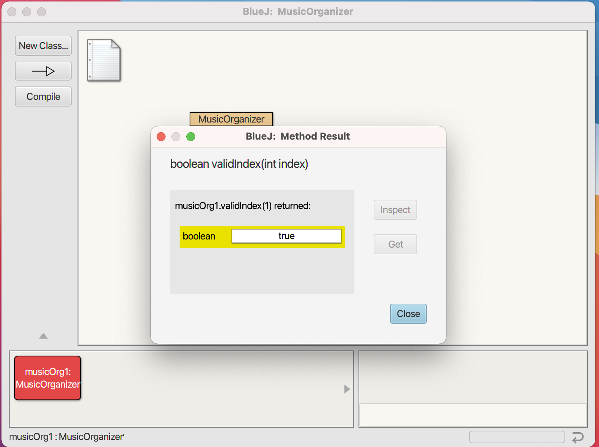
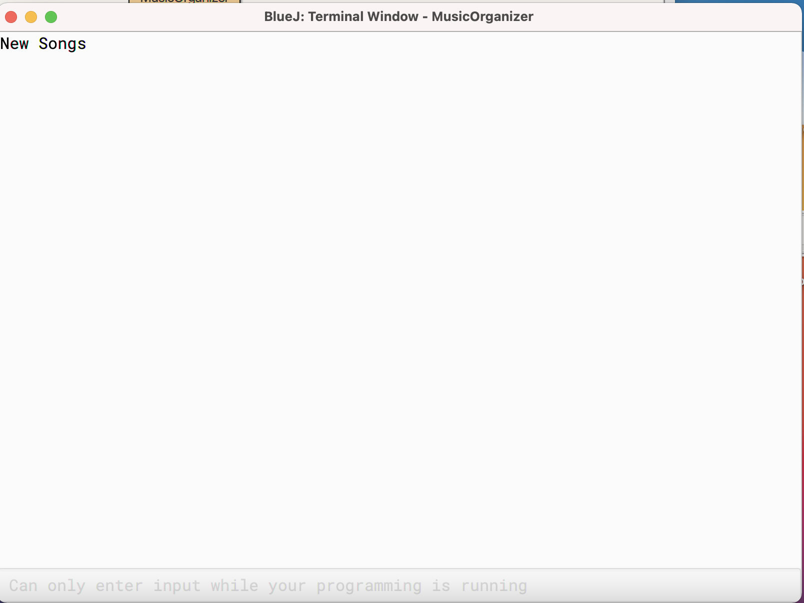
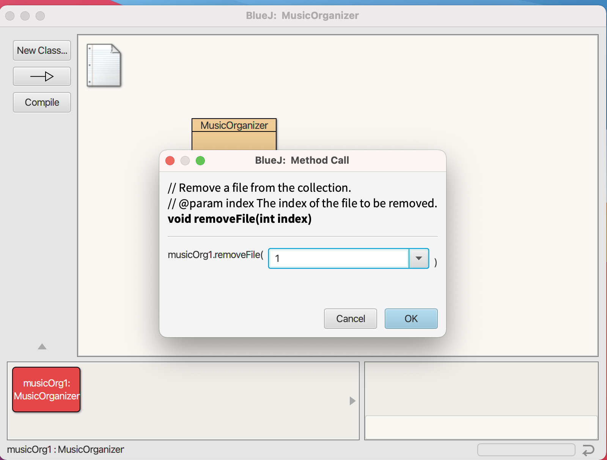

## Music Organiser

## Introduction

This project is simple MusicOrganiser to hold details of audio files built with BLUEJ.

### Prerequisites
* BLUEJ 4.2.2.

## List of Classes and its functions

| List of Classes |
| ------------|
| `1.MusicOrganiser`    | 

## ScreenShots

## Create New Music Organizer

## Add File To Collection

## Functions Of Music Organizer

## Get Number Of Files

## Check Index

## List File

## Valid Index 1

## Valid Index 2

## File Name With Index 2 In Collection

## Remove File

